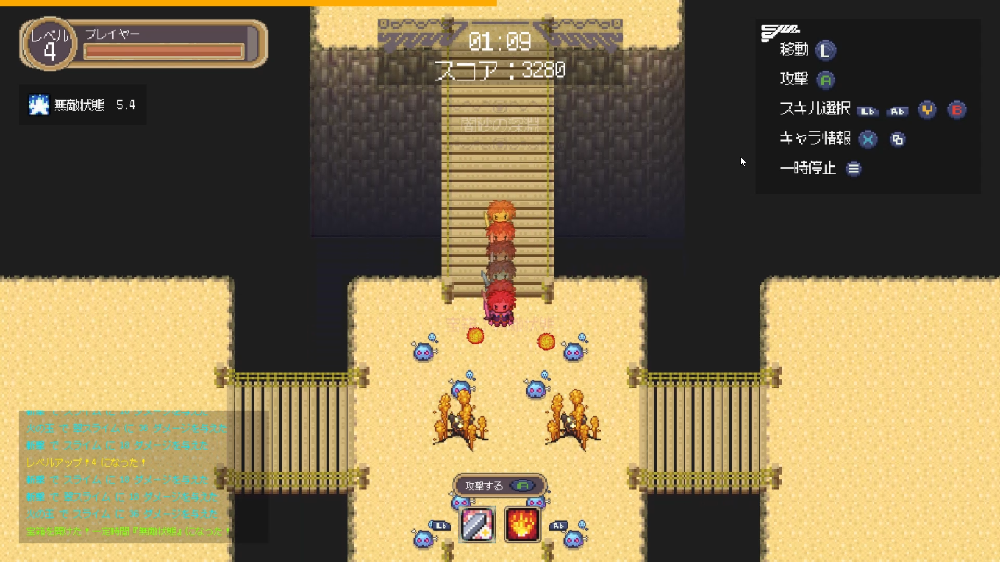
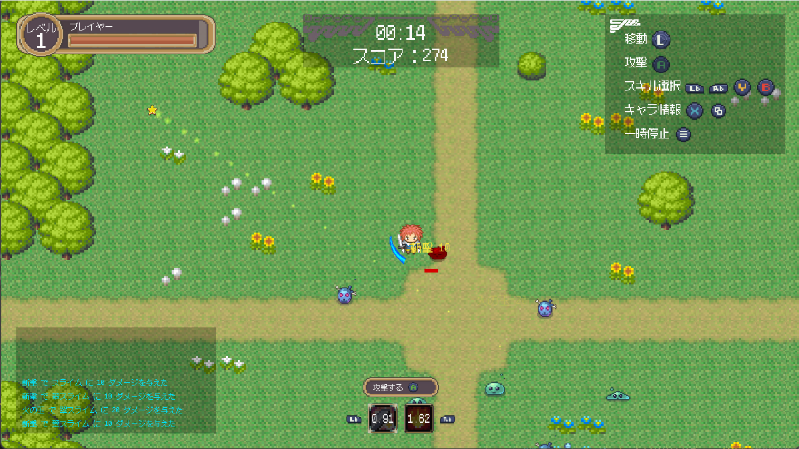
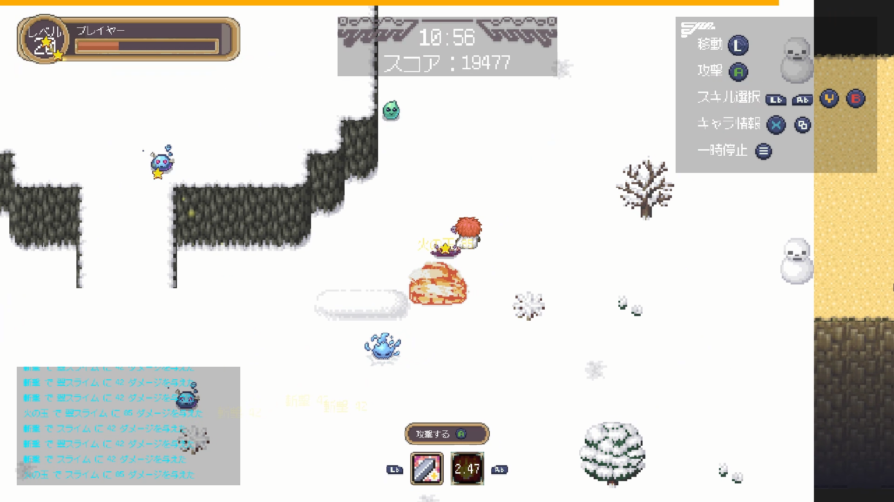

# 村の冒険者 | The Village Adventurer

**The Village Adventurer** is an Action RPG game which having an infinity world.

This game using **DirectX 11** and **CRIWARE**.

The project is written in **C++23**, with modules used wherever possible.

PV: https://youtu.be/ZSZEISwZSFU


| Player Buff      | Sword Attack     | Magic Long Range attack |
|------------------|------------------|-------------------------|
|  |  |         |

---

## Project Setup

1. **Decrypt assets with GPG**

    * Use WSL:

      ```sh
      make gpg decrypt-all
      ```

2. **Download and install CRIWARE ADX LE library**

    * Development uses version **2.29**.
    * Place the library files into the correct positions (see [Remark](#remark)).

3. **Open and build the solution**

    * Open the solution file in **Visual Studio Code** or **JetBrains Rider**, then build the project.

---

## Producing a Build

Post-build actions do not copy all required files automatically. To produce a working build, ensure files are placed in
the following structure:

```
./
├─ App.exe
├─ Game.lib
├─ Graphic.lib
├─ config.yaml
├─ cri_ware_pcx64_le.dll
├─ cri_ware_pcx64_le_import.lib
├─ assets/
│  ├─ audio/        # CRIWARE audio files (decrypt with gpg)
│  ├─ fonts/        # Requires .fnt + .png font spritesheets
│  └─ shaders/      # Compiled .cso files from build output
└─ map/
   ├─ assets/       # Only field.tsx is required, others can be deleted
   └─ map_data/     # Only the files defined in config.yaml are required
```

---

## Remark

To build and run the project, you must manually place the CRIWARE files in the correct locations:

```
roguelike-topdown-game/
├─ cri_ware_pcx64_le.dll
├─ cri_ware_pcx64_le_import.lib
└─ Game/
   └─ audio/
      └─ cri/
         ... (CRI ADX LE related header files)
```

---

## Credit

* このソフトウェアには、（株）ＣＲＩ・ミドルウェアの「CRIWARE」が使用されています。

